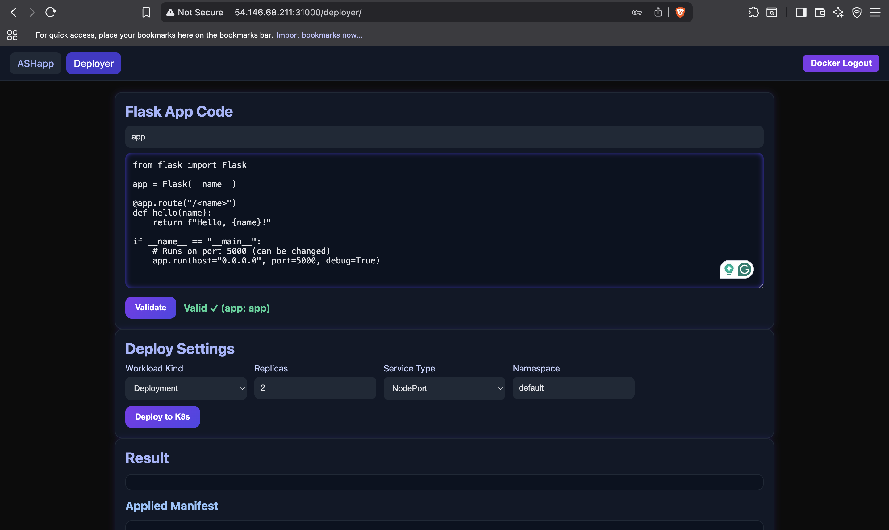
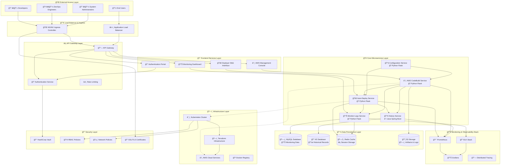
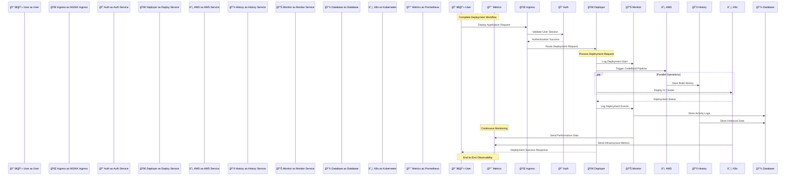
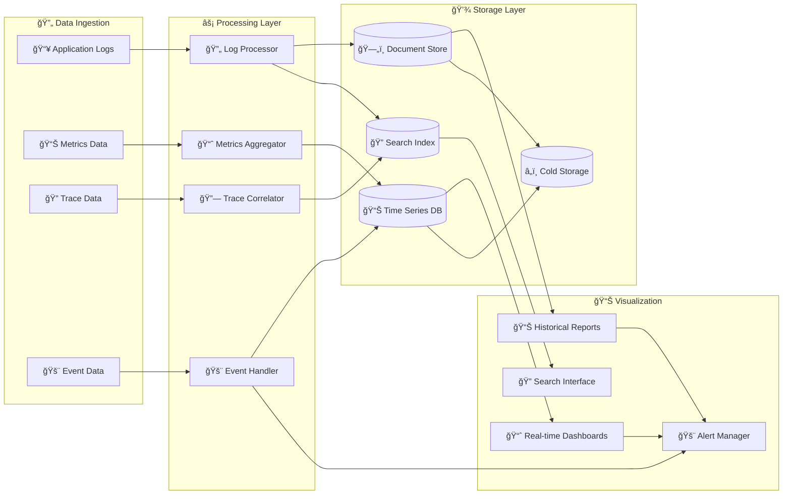

# Project Working Screenshots

Here are some working screenshots of the project:

## Screenshots

### Screenshot 1


### Screenshot 2


### Screenshot 3


### Screenshot 4


### Screenshot 5


### Screenshot 6


### Screenshot 7


### Screenshot 8


### Screenshot 9


### Screenshot 10


### Screenshot 11


### Screenshot 12


### Screenshot 13


### Screenshot 14


### Screenshot 15


### Screenshot 16


### Screenshot 17


### Screenshot 18


### Screenshot 19


### Screenshot 20


### Screenshot 21


### Screenshot 22


### Screenshot 23


# AWS Deployer Microservices Platform

> **An enterprise-grade, cloud-native microservices platform that automates application deployment, provides real-time monitoring, and manages infrastructure at scale**

[](https://opensource.org/licenses/MIT)
[](https://www.docker.com/)
[](https://kubernetes.io/)
[](https://www.python.org/)
[](https://openjdk.java.net/)

## 📋 Table of Contents

- [🯠Project Overview](#project-overview)
- [✨ Key Features](#key-features)
- [ğŸ—ï¸ System Architecture](#system-architecture)
- [� UML Design Diagrams](#uml-design-diagrams)
- [�🔧 Microservices Breakdown](#microservices-breakdown)
- [âš™ï¸ DevOps Strategy](#devops-strategy)
- [🚀 Deployment Architecture](#deployment-architecture)
- [📊 Monitoring & Observability](#monitoring--observability)
- [🔠Security Framework](#security-framework)
- [📈 Scalability Design](#scalability-design)
- [ğŸ› ï¸ Development Methodology](#development-methodology)
- [📚 System Integration](#system-integration)
- [🨠Design Patterns](#design-patterns)
- [🤠Contributing](#contributing)
- [📄 License](#license)

---

## 🯠Project Overview

The **AWS Deployer Microservices Platform** is a comprehensive, production-ready solution that demonstrates modern cloud-native architecture and DevOps excellence. This platform serves as a reference implementation for organizations looking to adopt microservices architecture, implement automated deployment pipelines, and establish enterprise-grade monitoring and security practices.

**Perfect for:**
- DevOps teams implementing microservices architecture
- Organizations adopting cloud-native practices
- Developers learning modern deployment strategies
- Companies seeking automated infrastructure management
- Educational purposes and technical demonstrations
- System architects designing scalable platforms

**Core Philosophy:**
This platform embodies the principles of **Infrastructure as Code**, **Continuous Integration/Continuous Deployment**, **Observability-First Design**, and **Security by Design**. Every component is built with production readiness, scalability, and maintainability as primary concerns.

## ✨ Key Features

### 🚀 **Deployment Automation**
- **Complete CI/CD Pipeline**: End-to-end automation from code commit to production deployment
- **Docker Integration**: Containerized applications with multi-stage build optimization
- **Kubernetes Orchestration**: Native Kubernetes deployment with intelligent resource management
- **Blue-Green Deployments**: Zero-downtime deployment strategies
- **Rollback Capabilities**: Automated rollback mechanisms for failed deployments

### 📊 **Real-time Monitoring & Observability**
- **Centralized Logging**: Aggregated logs from all microservices with intelligent filtering
- **Performance Metrics**: Comprehensive application and infrastructure monitoring
- **Distributed Tracing**: End-to-end request tracking across service boundaries
- **Real-time Dashboards**: Live visualization of system health and performance
- **Alerting System**: Proactive notification system for anomalies and issues

### ğŸ—ï¸ **Infrastructure Management**
- **Infrastructure as Code**: Terraform-managed AWS infrastructure with versioning
- **One-Click Setup**: Automated environment provisioning and configuration
- **Multi-Environment Support**: Development, staging, and production environments
- **Resource Optimization**: Intelligent resource allocation and cost optimization
- **Disaster Recovery**: Automated backup and recovery mechanisms

### 🔒 **Enterprise Security**
- **Zero-Trust Architecture**: Security-first design with network segmentation
- **Role-Based Access Control**: Granular permissions and access management
- **Secrets Management**: Encrypted credential storage and rotation
- **Compliance Ready**: Built-in compliance features for regulatory requirements
- **Security Scanning**: Automated vulnerability assessment and remediation

### 📈 **Intelligent Scaling**
- **Auto-scaling**: Dynamic resource scaling based on demand
- **Load Balancing**: Intelligent traffic distribution across instances
- **Performance Optimization**: Automatic performance tuning and optimization
- **Cost Management**: Resource usage optimization for cost efficiency
- **Capacity Planning**: Predictive scaling based on historical data

### 🌠**Modern Architecture**
- **Microservices Design**: Loosely coupled, independently deployable services
- **API-First Approach**: RESTful APIs with comprehensive documentation
- **Event-Driven Architecture**: Asynchronous communication between services
- **Service Mesh**: Advanced inter-service communication and security
- **Cloud-Native**: Designed for cloud environments with multi-cloud support

---

## ğŸ—ï¸ System Architecture

### 🨠**High-Level Architecture Overview**

The platform implements a sophisticated microservices architecture that follows industry best practices for cloud-native applications. The design emphasizes separation of concerns, scalability, and maintainability while ensuring high availability and performance.



### 📠**Service Communication Flow**

This diagram illustrates the sophisticated communication patterns and data flow between different services in the platform:



### 🔄 **Data Flow Architecture**



---

## 📠UML Design Diagrams

### ğŸ›ï¸ **High-Level Class Diagram**

```mermaid
classDiagram
    class DeploymentOrchestrator {
        +String deploymentId
        +DeploymentStatus status
        +DateTime createdAt
        +initiateDeployment()
        +monitorProgress()
        +handleFailure()
        +executeRollback()
    }
    
    class AutoDeployService {
        +DockerManager dockerManager
        +KubernetesManager k8sManager
        +SecurityManager securityManager
        +deployApplication()
        +validateDeployment()
        +configureResources()
    }
    
    class AWSCodeBuildService {
        +CodeBuildClient client
        +ProjectManager projectManager
        +ArtifactManager artifactManager
        +createProject()
        +triggerBuild()
        +manageBuildArtifacts()
    }
    
    class HistoryService {
        +HistoryRepository repository
        +AuditLogger auditLogger
        +DataArchiver archiver
        +saveDeploymentHistory()
        +queryHistoricalData()
        +generateReports()
    }
    
    class MonitoringService {
        +MetricsCollector collector
        +AlertManager alertManager
        +DashboardManager dashboard
        +collectMetrics()
        +processAlerts()
        +generateDashboards()
    }
    
    class InfrastructureManager {
        +TerraformEngine terraform
        +ResourceProvisioner provisioner
        +ConfigurationManager config
        +provisionInfrastructure()
        +manageResources()
        +handleScaling()
    }
    
    class SecurityManager {
        +AuthenticationService auth
        +AuthorizationService authz
        +SecretsManager secrets
        +NetworkPolicyManager network
        +authenticateUser()
        +authorizeAction()
        +manageSecrets()
    }
    
    class DatabaseManager {
        +ConnectionPool connectionPool
        +TransactionManager transactionManager
        +DataMapper mapper
        +executeQuery()
        +manageTransactions()
        +handleMigrations()
    }
    
    DeploymentOrchestrator ||--o{ AutoDeployService
    DeploymentOrchestrator ||--o{ AWSCodeBuildService
    AutoDeployService ||--|| SecurityManager
    AWSCodeBuildService ||--|| HistoryService
    HistoryService ||--|| DatabaseManager
    MonitoringService ||--|| DatabaseManager
    InfrastructureManager ||--|| SecurityManager
    AutoDeployService ||--|| MonitoringService
    AWSCodeBuildService ||--|| MonitoringService
```

### 🔄 **Service Interaction Component Diagram**


### 📊 **Deployment State Machine Diagram**


---

## 🔧 Microservices Breakdown

### 1. 🚀 **Auto Deploy Microservice**

**Business Purpose & Responsibility:**
The Auto Deploy Microservice serves as the central orchestrator for all deployment activities within the platform. It abstracts the complexity of container management and Kubernetes orchestration, providing a unified interface for deploying applications across different environments.

**Key Responsibilities:**
- **Docker Image Management**: Handles building, tagging, and pushing container images to registries
- **Kubernetes Orchestration**: Manages deployment manifests, service configurations, and ingress rules
- **Deployment Validation**: Performs pre-deployment checks and post-deployment verification
- **Security Integration**: Implements security scanning and compliance validation
- **Rollback Management**: Provides automated rollback capabilities for failed deployments

**Architecture Characteristics:**
- **Technology Stack**: Python Flask with asynchronous task processing
- **Integration Points**: Docker API, Kubernetes API, Security services, Monitoring services
- **Scalability**: Horizontally scalable with load balancing and state management
- **Resilience**: Circuit breaker patterns, retry mechanisms, and graceful degradation

### 2. â˜ï¸ **AWS CodeBuild Microservice**

**Business Purpose & Responsibility:**
This service manages the entire CI/CD pipeline integration with AWS services, providing seamless cloud-native build and deployment capabilities. It acts as the bridge between source code repositories and the deployment infrastructure.

**Key Responsibilities:**
- **Pipeline Orchestration**: Manages end-to-end CI/CD workflows
- **Build Management**: Coordinates build processes, testing, and artifact generation
- **AWS Integration**: Deep integration with AWS CodeBuild, ECR, S3, and other services
- **Quality Gates**: Implements quality checks, security scans, and compliance validations
- **Artifact Management**: Handles build artifacts, versioning, and distribution

**Architecture Characteristics:**
- **Technology Stack**: Python Flask with AWS SDK integration
- **Cloud Integration**: Native AWS services integration with fault tolerance
- **Event-Driven**: Webhook-based triggers and event-driven processing
- **Multi-Environment**: Support for development, staging, and production pipelines

### 3. 📚 **History Service Microservice**

**Business Purpose & Responsibility:**
The History Service provides comprehensive audit trails and historical data management, ensuring complete traceability of all system activities. It serves as the system of record for compliance, auditing, and operational insights.

**Key Responsibilities:**
- **Audit Logging**: Comprehensive logging of all system activities and user actions
- **Data Archival**: Long-term storage and retrieval of historical information
- **Compliance Reporting**: Generation of compliance reports and audit trails
- **Analytics Support**: Providing historical data for trend analysis and insights
- **Data Retention**: Implementing data retention policies and archival strategies

**Architecture Characteristics:**
- **Technology Stack**: Java Spring Boot with JPA/Hibernate for robust data management
- **Database Design**: Optimized for write-heavy workloads with efficient querying
- **Data Modeling**: Rich domain models with proper normalization and indexing
- **Performance**: Optimized for high-throughput logging with minimal latency impact

### 4. 📊 **Monitor & Logs Microservice**

**Business Purpose & Responsibility:**
This service forms the observability backbone of the platform, providing real-time monitoring, alerting, and operational insights. It ensures system health visibility and enables proactive issue detection and resolution.

**Key Responsibilities:**
- **Real-time Monitoring**: Continuous monitoring of application and infrastructure metrics
- **Log Aggregation**: Centralized collection and processing of logs from all services
- **Alerting System**: Intelligent alerting based on thresholds and anomaly detection
- **Dashboard Management**: Real-time dashboards for operational visibility
- **Performance Analytics**: Performance trend analysis and capacity planning

**Architecture Characteristics:**
- **Technology Stack**: Python Flask with SQLAlchemy for flexible data modeling
- **High Availability**: Clustered deployment with data replication and failover
- **Real-time Processing**: Stream processing capabilities for immediate insights
- **Scalable Storage**: Time-series databases optimized for metrics and logs

### 5. ğŸ—ï¸ **Infrastructure One-Click Setup**

**Business Purpose & Responsibility:**
This component provides complete infrastructure automation, enabling rapid environment provisioning and management. It embodies the Infrastructure as Code principles, ensuring consistent and reproducible infrastructure deployments.

**Key Responsibilities:**
- **Infrastructure Provisioning**: Automated creation of cloud resources using Terraform
- **Environment Management**: Support for multiple environments with consistent configurations
- **Resource Optimization**: Intelligent resource sizing and cost optimization
- **Disaster Recovery**: Automated backup and recovery mechanisms
- **Compliance**: Infrastructure compliance validation and security hardening

**Architecture Characteristics:**
- **Technology Stack**: Terraform for infrastructure, Bash scripts for orchestration
- **Cloud Agnostic**: Multi-cloud support with provider abstraction
- **Version Control**: Infrastructure versioning with rollback capabilities
- **Automation**: Fully automated with minimal manual intervention required

---

## âš™ï¸ DevOps Strategy

### 🯠**DevOps Philosophy & Principles**

The platform embodies modern DevOps principles, creating a culture of collaboration, automation, and continuous improvement. The strategy focuses on breaking down silos between development and operations teams while ensuring rapid, reliable software delivery.

**Core Principles:**
- **Automation First**: Every process is automated by default, with manual intervention as the exception
- **Infrastructure as Code**: All infrastructure is defined, versioned, and managed as code
- **Continuous Integration**: Frequent code integration with automated testing and validation
- **Continuous Deployment**: Automated deployment pipelines with robust rollback mechanisms
- **Monitoring & Observability**: Comprehensive visibility into system behavior and performance
- **Security by Design**: Security considerations integrated throughout the development lifecycle

### 🔄 **Continuous Integration/Continuous Deployment (CI/CD)**

**CI/CD Pipeline Architecture:**
The platform implements a sophisticated CI/CD pipeline that automates the entire software delivery process from code commit to production deployment. The pipeline ensures quality, security, and reliability at every stage.

**Pipeline Stages:**
1. **Source Control Integration**: Automated triggers on code commits and pull requests
2. **Build & Compilation**: Automated building of applications with dependency management
3. **Testing Suite**: Comprehensive testing including unit, integration, and security tests
4. **Quality Gates**: Code quality analysis, security scanning, and compliance checks
5. **Artifact Creation**: Container image building and artifact management
6. **Deployment Automation**: Automated deployment to target environments
7. **Monitoring & Validation**: Post-deployment monitoring and health verification
8. **Rollback Capability**: Automated rollback mechanisms for failed deployments

### 🳠**Containerization Strategy**

**Container Design Philosophy:**
The platform leverages containerization to ensure consistency, portability, and scalability across all environments. Each microservice is containerized using Docker with optimized images for production deployment.

**Container Optimization Techniques:**
- **Multi-stage Builds**: Reducing image size and improving security through layered building
- **Base Image Selection**: Using minimal, security-hardened base images
- **Layer Optimization**: Optimizing Docker layers for better caching and faster builds
- **Security Scanning**: Automated vulnerability scanning of container images
- **Registry Management**: Secure container registry with image signing and verification

### â˜¸ï¸ **Kubernetes Orchestration**

**Orchestration Strategy:**
Kubernetes serves as the container orchestration platform, providing automated deployment, scaling, and management of containerized applications. The platform leverages Kubernetes' native capabilities for resilience and scalability.

**Key Kubernetes Features Utilized:**
- **Deployment Management**: Declarative deployment configurations with rolling updates
- **Service Discovery**: Automatic service discovery and load balancing
- **Auto-scaling**: Horizontal Pod Autoscaling based on resource utilization
- **Resource Management**: Resource quotas, limits, and quality of service classes
- **Security**: Network policies, RBAC, and security contexts
- **Storage**: Persistent volumes and dynamic provisioning
- **Monitoring**: Integration with monitoring and logging systems

### 🔒 **Security Integration**

**Security-First Approach:**
Security is integrated throughout the DevOps pipeline, implementing defense-in-depth strategies and automated security controls. The platform ensures compliance with industry standards and best practices.

**Security Implementation Areas:**
- **Code Security**: Static code analysis and dependency vulnerability scanning
- **Container Security**: Image scanning, runtime protection, and compliance validation
- **Infrastructure Security**: Network segmentation, encryption, and access controls
- **Application Security**: Authentication, authorization, and input validation
- **Operational Security**: Audit logging, incident response, and security monitoring

---

## 🚀 Deployment Architecture

### ğŸ—ï¸ **Multi-Environment Strategy**

The platform supports multiple deployment environments, each optimized for different stages of the software development lifecycle. This approach ensures proper testing, validation, and gradual rollout of changes.

**Environment Hierarchy:**
- **Development Environment**: Rapid iteration with relaxed security for developer productivity
- **Staging Environment**: Production-like environment for integration testing and validation
- **Production Environment**: Highly available, secure, and monitored production deployment

**Environment Characteristics:**
Each environment maintains consistency in configuration while allowing for environment-specific optimizations. Infrastructure as Code ensures reproducibility across all environments.

### 🔄 **Deployment Strategies**

**Blue-Green Deployment:**
The platform implements blue-green deployment strategies to achieve zero-downtime deployments. This approach maintains two identical production environments, with traffic switched between them during deployments.

**Canary Deployment:**
For critical updates, the platform supports canary deployments, where changes are gradually rolled out to a subset of users before full deployment. This approach minimizes risk and allows for early detection of issues.

**Rolling Updates:**
Standard deployments use rolling update strategies, gradually replacing instances with new versions while maintaining service availability throughout the deployment process.

### 📊 **Resource Management**

**Intelligent Resource Allocation:**
The platform implements intelligent resource allocation strategies, ensuring optimal utilization of compute, memory, and storage resources across all environments.

**Auto-scaling Mechanisms:**
- **Horizontal Pod Autoscaling**: Automatic scaling of application instances based on CPU and memory utilization
- **Vertical Pod Autoscaling**: Automatic adjustment of resource requests and limits
- **Cluster Autoscaling**: Dynamic addition and removal of cluster nodes based on demand

**Cost Optimization:**
Resource allocation is optimized for cost efficiency while maintaining performance requirements. The platform implements strategies for resource right-sizing and efficient utilization.

---

## 📊 Monitoring & Observability

### 🔠**Comprehensive Observability Framework**

The platform implements a three-pillar observability strategy encompassing metrics, logging, and distributed tracing. This approach provides complete visibility into system behavior and performance.

**Observability Components:**
- **Metrics Collection**: Time-series metrics for performance monitoring and alerting
- **Distributed Logging**: Centralized log aggregation with intelligent filtering and analysis
- **Distributed Tracing**: End-to-end request tracing across service boundaries
- **Synthetic Monitoring**: Proactive monitoring through synthetic transactions
- **Real User Monitoring**: Actual user experience monitoring and analysis

### 📈 **Performance Monitoring**

**Key Performance Indicators (KPIs):**
The platform monitors critical performance metrics across all system components, providing insights into system health and performance trends.

**Monitoring Dimensions:**
- **Application Performance**: Response times, throughput, error rates, and availability
- **Infrastructure Performance**: CPU, memory, network, and storage utilization
- **Business Metrics**: User adoption, feature usage, and business impact metrics
- **Security Metrics**: Security events, compliance status, and threat detection

### 🚨 **Alerting & Incident Response**

**Intelligent Alerting System:**
The platform implements an intelligent alerting system that reduces noise while ensuring critical issues are promptly detected and escalated.

**Alert Management:**
- **Threshold-based Alerts**: Traditional threshold-based alerting for known conditions
- **Anomaly Detection**: Machine learning-based anomaly detection for unusual patterns
- **Alert Correlation**: Intelligent correlation of related alerts to reduce noise
- **Escalation Policies**: Automated escalation based on severity and response times

### 📊 **Dashboard & Visualization**

**Real-time Dashboards:**
The platform provides comprehensive dashboards for different stakeholders, offering relevant insights and actionable information.

**Dashboard Categories:**
- **Operational Dashboards**: Real-time system health and performance monitoring
- **Business Dashboards**: Business metrics and key performance indicators
- **Security Dashboards**: Security events, compliance status, and threat intelligence
- **Executive Dashboards**: High-level summaries and trend analysis

---

## 🔠Security Framework

### ğŸ›¡ï¸ **Defense-in-Depth Strategy**

The platform implements a comprehensive security framework based on defense-in-depth principles, ensuring multiple layers of protection across all system components.

**Security Layers:**
- **Perimeter Security**: Network firewalls, intrusion detection, and DDoS protection
- **Network Security**: Network segmentation, micro-segmentation, and encrypted communication
- **Application Security**: Secure coding practices, input validation, and output encoding
- **Data Security**: Encryption at rest and in transit, data classification, and access controls
- **Identity & Access Management**: Strong authentication, authorization, and privilege management

### 🔠**Identity & Access Management (IAM)**

**Authentication Framework:**
The platform implements multi-factor authentication and strong identity verification mechanisms to ensure only authorized users can access system resources.

**Authorization Model:**
- **Role-Based Access Control (RBAC)**: Granular permissions based on user roles and responsibilities
- **Attribute-Based Access Control (ABAC)**: Context-aware access decisions based on multiple attributes
- **Principle of Least Privilege**: Users and services receive minimum necessary permissions
- **Regular Access Reviews**: Periodic review and recertification of access rights

### 🔒 **Data Protection & Privacy**

**Data Security Measures:**
- **Encryption**: End-to-end encryption for data at rest and in transit
- **Data Classification**: Systematic classification and handling of sensitive data
- **Data Loss Prevention**: Automated detection and prevention of data leakage
- **Privacy Controls**: Implementation of privacy-by-design principles and regulations compliance

### 🚨 **Security Monitoring & Incident Response**

**Security Operations Center (SOC):**
The platform includes comprehensive security monitoring capabilities with automated threat detection and incident response procedures.

**Incident Response Framework:**
- **Detection**: Automated threat detection using multiple data sources and analytics
- **Analysis**: Rapid analysis and classification of security events and incidents
- **Containment**: Automated containment procedures to limit impact and spread
- **Recovery**: Systematic recovery procedures to restore normal operations
- **Lessons Learned**: Post-incident analysis and improvement implementation

---

## 📈 Scalability Design

### âš¡ **Horizontal Scaling Architecture**

The platform is designed for massive horizontal scalability, supporting growth from small deployments to enterprise-scale operations without architectural changes.

**Scaling Strategies:**
- **Stateless Design**: All services are designed to be stateless, enabling easy horizontal scaling
- **Load Distribution**: Intelligent load balancing and traffic distribution across instances
- **Database Scaling**: Horizontal database scaling with sharding and read replicas
- **Cache Layer**: Distributed caching for improved performance and reduced database load

### 📊 **Performance Optimization**

**Optimization Techniques:**
- **Caching Strategies**: Multi-level caching for improved response times
- **Database Optimization**: Query optimization, indexing, and connection pooling
- **Resource Right-sizing**: Continuous optimization of resource allocation
- **Code Optimization**: Performance profiling and optimization of critical code paths

### 🔄 **Auto-scaling Mechanisms**

**Intelligent Auto-scaling:**
The platform implements sophisticated auto-scaling mechanisms that respond to various metrics and predictive analytics.

**Scaling Triggers:**
- **Resource Utilization**: CPU, memory, and network utilization-based scaling
- **Request Rate**: Traffic-based scaling for handling varying load patterns
- **Custom Metrics**: Business metric-based scaling for application-specific requirements
- **Predictive Scaling**: Machine learning-based predictive scaling for anticipated demand

---

## ğŸ› ï¸ Development Methodology

### 🔄 **Agile Development Process**

The platform development follows agile methodologies with emphasis on continuous delivery and rapid iteration. The development process is optimized for team collaboration and quick feedback cycles.

**Development Practices:**
- **Scrum Framework**: Iterative development with regular sprints and retrospectives
- **Test-Driven Development**: Writing tests before implementation to ensure quality
- **Pair Programming**: Collaborative coding for knowledge sharing and quality improvement
- **Code Reviews**: Mandatory code reviews for all changes with automated quality checks

### 🧪 **Testing Strategy**

**Comprehensive Testing Pyramid:**
The platform implements a comprehensive testing strategy covering all levels of the application stack.

**Testing Levels:**
- **Unit Testing**: Isolated testing of individual components and functions
- **Integration Testing**: Testing of component interactions and data flow
- **System Testing**: End-to-end testing of complete system functionality
- **Performance Testing**: Load testing and performance validation under various conditions
- **Security Testing**: Automated security testing and vulnerability assessment

### 📚 **Documentation & Knowledge Management**

**Documentation Strategy:**
- **API Documentation**: Comprehensive API documentation with interactive examples
- **Architecture Documentation**: Detailed architectural decisions and design patterns
- **Operational Runbooks**: Step-by-step operational procedures and troubleshooting guides
- **Developer Guides**: Onboarding and development guides for new team members

---

## 📚 System Integration

### 🔗 **API Design & Management**

**RESTful API Architecture:**
The platform exposes well-designed RESTful APIs that follow industry standards and best practices for consistency and usability.

**API Features:**
- **OpenAPI Specification**: Comprehensive API documentation using OpenAPI/Swagger standards
- **Versioning Strategy**: Semantic versioning with backward compatibility guarantees
- **Rate Limiting**: Intelligent rate limiting to prevent abuse and ensure fair usage
- **Authentication**: Secure API authentication using modern standards like OAuth 2.0 and JWT

### 🔄 **Event-Driven Architecture**

**Asynchronous Communication:**
The platform leverages event-driven architecture for loose coupling and improved scalability between microservices.

**Event Management:**
- **Event Streaming**: Real-time event streaming for immediate processing and reaction
- **Event Sourcing**: Complete audit trail through event sourcing patterns
- **CQRS Implementation**: Command Query Responsibility Segregation for optimized read/write operations
- **Saga Pattern**: Distributed transaction management using the saga pattern

### 🌠**Third-Party Integrations**

**Integration Framework:**
The platform provides a robust framework for integrating with external systems and services.

**Integration Capabilities:**
- **Webhook Support**: Bidirectional webhook support for real-time notifications
- **API Gateway**: Centralized API gateway for managing external integrations
- **Protocol Support**: Support for multiple communication protocols (REST, GraphQL, gRPC)
- **Data Synchronization**: Real-time and batch data synchronization capabilities

---

## 🨠Design Patterns

### ğŸ—ï¸ **Architectural Patterns**

**Microservices Pattern:**
The platform implements the microservices architectural pattern, providing independence, scalability, and technology diversity.

**Service Mesh Pattern:**
Advanced service-to-service communication using service mesh architecture for enhanced security and observability.

**CQRS (Command Query Responsibility Segregation):**
Separation of read and write operations for improved performance and scalability.

**Event Sourcing:**
Complete audit trail and state reconstruction through event sourcing implementation.

### 🔄 **Integration Patterns**

**API Gateway Pattern:**
Centralized entry point for all client requests with cross-cutting concerns like authentication and rate limiting.

**Circuit Breaker Pattern:**
Fault tolerance implementation to prevent cascading failures in distributed systems.

**Bulkhead Pattern:**
Resource isolation to prevent failures in one component from affecting others.

**Retry Pattern:**
Automatic retry mechanisms with exponential backoff for handling transient failures.

### 💾 **Data Patterns**

**Repository Pattern:**
Abstraction layer for data access, providing clean separation between business logic and data persistence.

**Unit of Work Pattern:**
Transaction management and coordination across multiple repositories and data sources.

**CQRS with Event Sourcing:**
Advanced data architecture pattern for high-performance and audit-compliant systems.

---

## 🤠Contributing

### 👥 **Community & Collaboration**

We welcome contributions from the community and believe in the power of collaborative development. Our contribution process is designed to be inclusive, transparent, and efficient.

**Ways to Contribute:**
- **Code Contributions**: Bug fixes, feature implementations, and performance improvements
- **Documentation**: Improving documentation, tutorials, and examples
- **Testing**: Writing tests, reporting bugs, and improving test coverage
- **Design**: UI/UX improvements and design system contributions
- **Community**: Helping other users, answering questions, and sharing knowledge

### 📋 **Development Standards**

**Code Quality Standards:**
- **Style Guidelines**: Consistent coding style across all languages and frameworks
- **Documentation Requirements**: Comprehensive documentation for all public APIs and features
- **Testing Standards**: Minimum test coverage requirements and testing best practices
- **Security Standards**: Security review requirements and vulnerability assessment
- **Performance Standards**: Performance benchmarks and optimization requirements

### 🔄 **Contribution Workflow**

**Standard Workflow:**
1. **Fork & Clone**: Fork the repository and clone to your local development environment
2. **Feature Branch**: Create a feature branch for your contribution
3. **Development**: Implement your changes following our development standards
4. **Testing**: Write comprehensive tests and ensure all existing tests pass
5. **Documentation**: Update documentation to reflect your changes
6. **Pull Request**: Submit a pull request with detailed description and context
7. **Review Process**: Participate in code review and address feedback
8. **Integration**: Automated testing and integration after approval

---

## 📄 License

This project is licensed under the **MIT License**, which provides maximum flexibility for both commercial and non-commercial use while ensuring proper attribution.

**License Highlights:**
- **Freedom to Use**: Use the software for any purpose, commercial or non-commercial
- **Freedom to Modify**: Modify the source code to meet your specific requirements
- **Freedom to Distribute**: Distribute original or modified versions of the software
- **Attribution Required**: Include proper attribution and license notices
- **No Warranty**: Software provided "as-is" without warranties or guarantees

For complete license terms, please see the [LICENSE](LICENSE) file in the repository.

---

## 👥 Support & Community

### 💬 **Community Channels**

**Getting Help:**
- **GitHub Issues**: Report bugs, request features, and get technical support
- **GitHub Discussions**: Ask questions, share ideas, and engage with the community
- **Documentation Wiki**: Comprehensive guides, tutorials, and best practices
- **Community Slack**: Real-time chat and collaboration with other users and contributors

**Community Guidelines:**
We are committed to fostering an inclusive, welcoming, and harassment-free community. Please review our code of conduct and community guidelines before participating.

### 📚 **Resources & Learning**

**Educational Resources:**
- **Getting Started Guide**: Step-by-step tutorial for new users
- **Best Practices**: Curated collection of best practices and design patterns
- **Video Tutorials**: Video walkthroughs and demonstrations
- **Case Studies**: Real-world implementation examples and success stories
- **API Reference**: Comprehensive API documentation and examples

### 🯠**Roadmap & Future Development**

**Platform Evolution:**
This platform continues to evolve with new features, performance improvements, and security enhancements. Our roadmap is driven by community feedback, industry trends, and emerging technologies.

**Upcoming Features:**
- **Multi-Cloud Support**: Extended support for additional cloud providers
- **AI/ML Integration**: Machine learning-powered insights and automation
- **Advanced Security**: Enhanced security features and compliance capabilities
- **Performance Optimization**: Continued performance improvements and optimizations
- **Developer Experience**: Improved tooling and developer productivity features

---

**🚀 Built with passion by the DevOps Engineering Community**

*Empowering organizations to achieve DevOps excellence through modern, scalable, and secure microservices architecture.*


### 📠Component Interaction Flow

The following sequence diagram illustrates how different services interact within the platform:


---

## 🔧 Microservices Breakdown

The platform consists of five core microservices, each designed with a specific responsibility and built using industry-standard technologies. This section provides detailed insights into each service's architecture and functionality.

### 1. 🚀 Auto Deploy Microservice

**Purpose**: Provides automated Docker and Kubernetes deployment capabilities with enterprise-grade security and monitoring features.

**Technology Stack**:
- **Backend**: Python Flask application
- **Frontend**: Static web interface with modern UI/UX
- **Container**: Docker Hub integration for image management
- **Orchestration**: Direct Kubernetes API integration

**Core Capabilities**:
```python
# Secure Docker authentication and management
@deployer_bp.route("/docker-login", methods=["POST"])
def docker_login():
    # Implements secure Docker Hub authentication
    # Provides automated image building and pushing
    # Includes credential masking and comprehensive security logging
    pass

# Intelligent Kubernetes deployment automation
@deployer_bp.route("/deploy", methods=["POST"])  
def deploy_to_kubernetes():
    # Generates optimized YAML manifests
    # Executes automated kubectl operations
    # Provides real-time deployment status monitoring
    pass
```

**Infrastructure Configuration**:
- **Auto-scaling**: HPA configured for 1-10 replicas based on CPU/memory usage
- **Service Discovery**: ClusterIP service exposing port 5000
- **Security**: Dedicated RBAC with deployer service account
- **Network Isolation**: Custom network policies for controlled access

### 2. â˜ï¸ AWS CodeBuild Microservice

**Purpose**: Integrates with AWS services to provide comprehensive CI/CD pipeline management and cloud operations automation.

**Technology Stack**:
- **Main Backend**: Python Flask with AWS SDK integration
- **Static Frontend**: Responsive HTML/CSS/JavaScript interface  
- **Authentication**: React-based secure login module
- **Cloud Integration**: Native AWS CodeBuild, ECR, and other AWS services

**Core Capabilities**:
```python
# Dynamic AWS CodeBuild project management
@app.route("/create-codebuild-project", methods=["POST"])
def create_codebuild_project():
    # Creates and configures CodeBuild projects dynamically
    # Integrates with GitHub for source code management
    # Implements automated build triggers and notifications
    pass

# Comprehensive AWS CLI operations interface
@app.route("/aws-operation", methods=["POST"])
def aws_operation():
    # Executes dynamic AWS CLI commands securely
    # Provides secure credential management
    # Offers real-time operation monitoring and logging
    pass
```

**Service Integration Architecture**:
- **History Service**: `http://history-service:8081` for audit trail management
- **Monitor Service**: `http://flask-monitor:6000` for activity logging
- **Deployer Service**: `http://deployer-app:5000` for deployment coordination

### 3. 📚 History Service Microservice

**Purpose**: Provides comprehensive audit trail and historical data management using enterprise Java technologies.

**Technology Stack**:
- **Backend**: Spring Boot application with JPA/Hibernate
- **Database**: H2 embedded database with file persistence
- **API**: RESTful web services with JSON payload support

**Core Capabilities**:
```java
@RestController
@RequestMapping("/history")
public class HistoryController {
    
    @PostMapping("/save")
    public ResponseEntity<String> saveHistory(@RequestBody HistoryRequest request) {
        // Implements persistent audit logging with data validation
        // Provides structured data storage with indexing
        // Includes automatic timestamping and metadata capture
        return ResponseEntity.ok("History saved successfully");
    }
    
    @GetMapping("/list")
    public List<History> getHistory() {
        // Offers paginated history retrieval with sorting
        // Supports advanced filtering and search capabilities
        // Delivers performance-optimized database queries
        return historyService.getAllHistory();
    }
}
```

**Data Model Architecture**:
```java
@Entity
public class History {
    @Id
    @GeneratedValue(strategy = GenerationType.IDENTITY)
    private Long id;
    
    @Column(nullable = false, length = 1000)
    private String query;
    
    @Lob
    private String output;
    
    @CreationTimestamp
    private LocalDateTime timestamp;
    
    // Additional metadata fields for comprehensive tracking
}
```

### 4. 📊 Monitor & Logs Microservice

**Purpose**: Serves as the central observability hub, providing comprehensive logging, monitoring, and real-time activity tracking across the entire platform.

**Technology Stack**:
- **Backend**: Python Flask with SQLAlchemy ORM
- **Database**: MySQL with Kubernetes StatefulSet for high availability
- **Web Interface**: Real-time dashboard with live activity feeds

**Core Capabilities**:
```python
class UserAction(db.Model):
    """
    Comprehensive activity tracking model for enterprise-grade auditing
    """
    __tablename__ = "user_actions"
    id = db.Column(db.Integer, primary_key=True)
    timestamp = db.Column(db.DateTime, default=datetime.utcnow, index=True)
    user_id = db.Column(db.String(128), index=True)
    service = db.Column(db.String(50), index=True)
    endpoint = db.Column(db.String(128))
    action_type = db.Column(db.String(128), index=True)
    request_data = db.Column(db.Text)
    response_summary = db.Column(db.Text)
    ip_address = db.Column(db.String(45))
    user_agent = db.Column(db.String(256))

@app.route("/monitor/log", methods=["POST"])
def log_action():
    """
    Secure activity logging with automatic data sanitization
    """
    # Implements structured logging with sensitive data masking
    # Provides real-time activity tracking across all services
    # Ensures secure handling of confidential information
    pass
```

**Advanced Monitoring Features**:
- **Real-time Activity Dashboard**: Live feed of system activities
- **Service Performance Metrics**: Response times and error rate tracking
- **User Behavior Analytics**: Comprehensive usage pattern analysis
- **Security Audit Trails**: Complete security event monitoring

### 5. ğŸ—ï¸ Infrastructure One-Click Setup

**Purpose**: Provides complete infrastructure automation and one-click environment provisioning for rapid deployment and scaling.

**Technology Stack**:
- **Infrastructure as Code**: Terraform for AWS resource management
- **Automation Scripts**: Bash scripts for Kubernetes cluster configuration
- **Container Orchestration**: Complete Kubernetes manifest suite

**Infrastructure Components**:
```terraform
# Scalable EC2 instance configuration for Kubernetes master node
resource "aws_instance" "demo" {
  ami           = var.ami_id
  instance_type = var.instance_type
  key_name      = "ashwanthramnv"
  
  # Automated setup with GitHub Actions runner integration
  user_data = templatefile("${path.module}/setup.sh", {
    runner_token = var.runner_token
  })
  
  tags = {
    Name        = "awsdeployer"
    Environment = "production"
    Project     = "microservices-platform"
  }
}
```

**Comprehensive Automation Features**:
```bash
#!/bin/bash
# Complete production-ready Kubernetes cluster setup
# - Docker installation and optimization
# - Kubernetes cluster initialization with kubeadm
# - Weave network plugin for pod communication
# - NGINX ingress controller for external access
# - Metrics server for monitoring and HPA
# - Prometheus and Grafana for observability
```

---

## âš™ï¸ DevOps & Infrastructure

This section outlines the comprehensive DevOps strategy and infrastructure patterns implemented in the platform, designed to meet enterprise standards for reliability, scalability, and maintainability.

### 🳠Advanced Containerization Strategy

The platform implements multi-stage Docker builds and optimization techniques for production efficiency:

```dockerfile
# Production-optimized multi-stage build
FROM python:3.11-slim as builder
WORKDIR /app
COPY requirements.txt .
RUN pip install --no-cache-dir --user -r requirements.txt

FROM python:3.11-slim
WORKDIR /app
COPY --from=builder /root/.local /root/.local
COPY . .
EXPOSE 5000
HEALTHCHECK --interval=30s --timeout=3s --start-period=5s --retries=3 \
  CMD curl -f http://localhost:5000/health || exit 1
CMD ["python", "app.py"]
```

### â˜¸ï¸ Enterprise Kubernetes Architecture

The platform implements enterprise-grade Kubernetes patterns with comprehensive resource management and security:
**Production Deployment Configuration**:
```yaml
apiVersion: apps/v1
kind: Deployment
metadata:
  name: flask-app
  namespace: ashapp
  labels:
    app: flask-app
    version: v1.0.0
spec:
  replicas: 1
  strategy:
    type: RollingUpdate
    rollingUpdate:
      maxSurge: 1
      maxUnavailable: 0
  selector:
    matchLabels:
      app: flask-app
  template:
    metadata:
      labels:
        app: flask-app
    spec:
      serviceAccountName: flask-sa
      securityContext:
        runAsNonRoot: true
        fsGroup: 2000
      containers:
      - name: flask-app
        image: ashwanth01/flask-app:latest
        ports:
        - containerPort: 5000
          protocol: TCP
        env:
        - name: PYTHONUNBUFFERED
          value: "1"
        resources:
          requests:
            memory: "256Mi"
            cpu: "250m"
          limits:
            memory: "512Mi"
            cpu: "500m"
        livenessProbe:
          tcpSocket:
            port: 5000
          initialDelaySeconds: 15
          periodSeconds: 10
        readinessProbe:
          tcpSocket:
            port: 5000
          initialDelaySeconds: 5
          periodSeconds: 5
```

**Intelligent Auto-scaling Configuration**:
```yaml
apiVersion: autoscaling/v2
kind: HorizontalPodAutoscaler
metadata:
  name: flask-app-hpa
spec:
  scaleTargetRef:
    apiVersion: apps/v1
    kind: Deployment
    name: flask-app
  minReplicas: 1
  maxReplicas: 10
  metrics:
  - type: Resource
    resource:
      name: cpu
      target:
        type: Utilization
        averageUtilization: 70
```

### 🔠Enterprise Security Implementation

The platform implements multiple layers of security following industry best practices and compliance requirements.

**Advanced RBAC Configuration**:
```yaml
apiVersion: rbac.authorization.k8s.io/v1
kind: Role
metadata:
  namespace: ashapp
  name: flask-role
rules:
- apiGroups: [""]
  resources: ["pods", "services"]
  verbs: ["get", "list", "create", "update", "delete"]
```

**Zero-Trust Network Policies**:
```yaml
apiVersion: networking.k8s.io/v1
kind: NetworkPolicy
metadata:
  name: flask-app-netpol
  namespace: ashapp
spec:
  podSelector:
    matchLabels:
      app: flask-app
  policyTypes:
  - Ingress
  - Egress
  ingress:
  - from:
    - podSelector:
        matchLabels:
          role: frontend
    - namespaceSelector:
        matchLabels:
          name: monitoring
    ports:
    - protocol: TCP
      port: 5000
  egress:
  - to:
    - podSelector:
        matchLabels:
          app: database
    ports:
    - protocol: TCP
      port: 3306
```

---

## 🚀 Getting Started

This comprehensive guide will help you deploy the AWS Deployer Microservices Platform in your environment, whether for development, testing, or production use.

### 📋 Prerequisites

Before beginning the installation, ensure your environment meets these requirements:

| Tool | Version | Purpose |
|------|---------|---------|
| Docker | 20.10+ | Containerization |
| Kubernetes | 1.24+ | Orchestration |
| kubectl | 1.24+ | K8s CLI |
| Terraform | 1.5+ | Infrastructure |
| Python | 3.9+ | Backend development |
| Java | 11+ | Spring Boot services |
| Node.js | 16+ | Frontend development |

### 🔧 Installation & Deployment

Follow these step-by-step instructions to deploy the complete platform:

#### Step 1: Infrastructure Provisioning

Begin by setting up the underlying AWS infrastructure using Terraform:

```bash
# Clone the repository
git clone https://github.com/ashwanth01-pixel/awsdeployer-microservices.git
cd awsdeployer-microservices

# Navigate to infrastructure directory
cd INFRA-ONECLICK/terraform

# Configure AWS credentials
aws configure

# Initialize Terraform
terraform init

# Review infrastructure plan
terraform plan

# Deploy infrastructure
terraform apply -auto-approve

# Setup Kubernetes cluster
cd ../
chmod +x setup.sh
./setup.sh
```

#### Step 2: Core Infrastructure Deployment

Deploy the foundational Kubernetes resources:

```bash
# Create namespace and apply core resources
kubectl apply -f INFRA-ONECLICK/k8s/

# Verify namespace creation
kubectl get namespace ashapp

# Confirm ingress controller is running
kubectl get pods -n ingress-nginx
```

#### Step 3: Deploy Microservices

Deploy services in the correct order to ensure proper dependencies:

**3.1 Deploy Monitor Service (Required First)**:
```bash
cd MONITOR-LOGS-MICROSERVICE/backend

# Build and push Docker image
docker build -t ashwanth01/flask-monitor:latest .
docker push ashwanth01/flask-monitor:latest

# Deploy to Kubernetes
kubectl apply -f k8s/

# Verify deployment
kubectl get pods -n ashapp -l app=flask-monitor
```

**3.2 Deploy History Service**:
```bash
cd HISTORY-SERVICE-MICROSERVICE/backend/history-services

# Build Java application
mvn clean package

# Build and push Docker image
docker build -t ashwanth01/history-service:latest .
docker push ashwanth01/history-service:latest

# Deploy to Kubernetes
kubectl apply -f ../../k8s/

# Verify deployment
kubectl get pods -n ashapp -l app=history-service
```

**3.3 Deploy AWS CodeBuild Service**:
```bash
cd AWS-CB-MICROSERVICE/backend

# Build and push Docker image
docker build -t ashwanth01/flask-app:latest .
docker push ashwanth01/flask-app:latest

# Deploy to Kubernetes
kubectl apply -f k8s/

# Verify deployment
kubectl get pods -n ashapp -l app=flask-app
```

**3.4 Deploy Auto Deploy Service**:
```bash
cd AUTODEPLOY-MICROSERVICE/backend

# Build and push Docker image
docker build -f deployer-dockerfile -t ashwanth01/deployer-app:latest .
docker push ashwanth01/deployer-app:latest

# Deploy to Kubernetes
kubectl apply -f k8s/

# Verify deployment
kubectl get pods -n ashapp -l app=deployer-app
```

#### Step 4: Verification and Access

Verify that all services are running correctly and access the applications:

```bash
# Check all pods are running
kubectl get pods -n ashapp

# Verify services are accessible
kubectl get services -n ashapp

# Check ingress configuration
kubectl get ingress -n ashapp

# Monitor deployment status
kubectl get deployments -n ashapp

# View application logs
kubectl logs -f deployment/flask-app -n ashapp
```

#### Step 5: Access Applications

Set up port forwarding to access the services locally:

```bash
# Port forward to access services locally
kubectl port-forward service/flask-app 8080:5000 -n ashapp &
kubectl port-forward service/deployer-app 8081:5000 -n ashapp &
kubectl port-forward service/flask-monitor 8082:6000 -n ashapp &
kubectl port-forward service/history-service 8083:8081 -n ashapp &

# Access applications in your browser
echo "Main Application: http://localhost:8080"
echo "Deployer Interface: http://localhost:8081"
echo "Monitoring Dashboard: http://localhost:8082/monitor"
echo "History API: http://localhost:8083/history/list"
```

### ğŸƒâ€â™‚ï¸ Quick Start Options

For rapid deployment, we provide automated scripts:

```bash
# One-command deployment (after infrastructure setup)
./scripts/deploy-all.sh

# Comprehensive system health check
./scripts/health-check.sh

# Aggregate all service logs
./scripts/view-logs.sh

# Scale services based on demand
kubectl scale deployment flask-app --replicas=3 -n ashapp
```

---

## 📊 Monitoring & Observability

The platform provides enterprise-grade observability with comprehensive monitoring, logging, and alerting capabilities designed for production environments.

### 🔠Comprehensive Monitoring Stack

The observability solution includes multiple layers of monitoring to ensure complete system visibility:

- **📋 Application Logs**: Centralized logging via the Monitor Service with real-time aggregation
- **📈 Infrastructure Metrics**: Prometheus and Grafana for comprehensive system monitoring
- **💓 Health Monitoring**: Kubernetes health probes with custom health check endpoints
- **🔗 Distributed Tracing**: Inter-service communication tracking and performance analysis
- **🚨 Alerting**: Real-time alerts for system anomalies and performance issues
- **📊 Custom Dashboards**: Business metrics and KPI visualization

### 📈 Key Performance Indicators

The platform monitors critical metrics across all layers of the application stack:

| Metric Category | Key Indicators | Monitoring Tool | Alert Thresholds |
|----------------|----------------|-----------------|------------------|
| Application Performance | Response times, error rates, throughput | Custom logging + Prometheus | >2s response time, >5% error rate |
| Infrastructure Health | CPU, Memory, Network, Disk I/O | Prometheus + Node Exporter | >80% CPU, >85% Memory |
| Service Dependencies | Inter-service latency, availability | Monitor Service | >1s latency, <99% availability |
| Security Events | Authentication failures, unauthorized access | Audit logs + SIEM | Failed login attempts, privilege escalation |
| Business Metrics | Deployment success rates, user adoption | Custom dashboards | <95% success rate |

### 🯠Accessing Monitoring Features

```bash
# Access real-time monitoring dashboard
curl http://localhost:8082/monitor

# Check overall system health
kubectl get pods -n ashapp -o wide

# View detailed resource usage
kubectl top pods -n ashapp

# Access Grafana dashboards (if configured)
kubectl port-forward service/grafana 3000:3000 -n monitoring

# View Prometheus metrics
kubectl port-forward service/prometheus 9090:9090 -n monitoring
```

---

## 🔠Security Features

The platform implements a multi-layered security approach following industry standards and compliance requirements, ensuring robust protection for enterprise environments.

### ğŸ›¡ï¸ Authentication & Authorization Framework

- **🔑 RBAC**: Comprehensive Kubernetes role-based access control with principle of least privilege
- **👤 Service Accounts**: Dedicated service accounts for each microservice with specific permissions
- **🌠Network Segmentation**: Zero-trust network policies for traffic isolation and control
- **🔒 Secrets Management**: Kubernetes secrets with encryption at rest and in transit
- **🔠TLS/SSL**: End-to-end encryption for all service communications
- **📠Audit Logging**: Complete audit trail of all authentication and authorization events

### 🔒 Data Protection & Privacy

- **🭠Credential Masking**: Automatic masking of sensitive data in logs and monitoring
- **🔠Encrypted Storage**: Database encryption for sensitive application data
- **✅ Input Validation**: Comprehensive request validation and sanitization
- **📊 Activity Monitoring**: Real-time monitoring of all user and system activities
- **🚨 Threat Detection**: Automated detection of suspicious activities and security events

### 🔧 Security Configuration Examples

```yaml
# Example RBAC configuration
apiVersion: rbac.authorization.k8s.io/v1
kind: ClusterRole
metadata:
  name: deployment-manager
rules:
- apiGroups: ["apps"]
  resources: ["deployments"]
  verbs: ["get", "list", "create", "update", "patch", "delete"]
```

---

## 📈 Scalability & Performance

### Auto-scaling Strategy

- **Horizontal Pod Autoscaling**: Based on CPU/memory metrics
- **Vertical Pod Autoscaling**: Automatic resource adjustment
- **Cluster Autoscaling**: Node scaling based on demand

### Performance Optimizations

- **Container Resource Limits**: Proper resource allocation
- **Database Connection Pooling**: Efficient database usage
- **Caching Strategies**: Redis for session management
- **Load Balancing**: NGINX ingress with intelligent routing

### Scaling Commands

```bash
# Manual scaling
kubectl scale deployment flask-app --replicas=5 -n ashapp

# Update HPA configuration
kubectl patch hpa flask-app-hpa -p '{"spec":{"maxReplicas":20}}' -n ashapp

# View scaling events
kubectl describe hpa flask-app-hpa -n ashapp
```

---

## ğŸ› ï¸ Development Workflow

### Local Development

1. **Environment Setup**:
```bash
# Create virtual environment
python -m venv venv
source venv/bin/activate

# Install dependencies
pip install -r requirements.txt
```

2. **Local Testing**:
```bash
# Run unit tests
python -m pytest tests/

# Run integration tests
./scripts/integration-tests.sh

# Local development server
flask run --debug
```

3. **Docker Development**:
```bash
# Build local image
docker build -t local/service:dev .

# Run with docker-compose
docker-compose up -d
```

### CI/CD Pipeline

The platform supports automated CI/CD with:

- **Build Stage**: Docker image creation
- **Test Stage**: Unit and integration tests
- **Security Scan**: Container vulnerability scanning
- **Deploy Stage**: Automated Kubernetes deployment
- **Smoke Tests**: Post-deployment validation

### Git Workflow

```bash
# Feature development
git checkout -b feature/new-functionality
git commit -m "feat: add new deployment feature"
git push origin feature/new-functionality

# Create pull request for review
# Automated CI/CD pipeline triggers
# Deploy to staging environment
# Production deployment after approval
```

---

## 📚 API Documentation

### Auto Deploy Service API

#### Docker Operations
```http
POST /deployer-api/docker-login
Content-Type: application/json

{
  "docker_user": "username",
  "docker_token": "access_token"
}
```

#### Kubernetes Deployment
```http
POST /deployer-api/deploy
Content-Type: application/json

{
  "repo_url": "https://github.com/user/repo.git",
  "image_name": "myapp",
  "tag": "latest",
  "namespace": "production"
}
```

### AWS CB Service API

#### CodeBuild Project Management
```http
POST /create-codebuild-project
Content-Type: application/json

{
  "project_name": "my-project",
  "source_location": "https://github.com/user/repo.git",
  "build_spec": "buildspec.yml"
}
```

#### AWS Operations
```http
POST /aws-operation
Content-Type: application/json

{
  "operation": "list-instances",
  "region": "us-east-1",
  "access_key": "AKIA...",
  "secret_key": "secret"
}
```

### History Service API

#### Save History
```http
POST /history/save
Content-Type: application/json

{
  "query": "deploy app to production",
  "output": "Deployment successful"
}
```

#### Get History
```http
GET /history/list
```

### Monitor Service API

#### Log Activity
```http
POST /monitor/log
Content-Type: application/json

{
  "user_id": "user123",
  "service": "deployer",
  "endpoint": "/deploy",
  "action_type": "deployment",
  "request_data": {"app": "myapp"},
  "response_summary": {"status": "success"}
}
```

#### View Logs
```http
GET /monitor
```

---

## 🔧 Troubleshooting

### Common Issues

#### Pod Startup Issues
```bash
# Check pod status
kubectl get pods -n ashapp

# View pod logs
kubectl logs <pod-name> -n ashapp

# Describe pod for events
kubectl describe pod <pod-name> -n ashapp
```

#### Service Communication Issues
```bash
# Test service connectivity
kubectl exec -it <pod-name> -n ashapp -- curl http://service-name:port

# Check service endpoints
kubectl get endpoints -n ashapp

# Verify network policies
kubectl get networkpolicies -n ashapp
```

#### Database Connection Issues
```bash
# Check MySQL StatefulSet
kubectl get statefulset -n ashapp

# View PVC status
kubectl get pvc -n ashapp

# Test database connectivity
kubectl exec -it mysql-0 -n ashapp -- mysql -u root -p
```

### Health Checks

```bash
# Service health endpoints
curl http://localhost:8080/health
curl http://localhost:8081/health
curl http://localhost:8082/health

# Kubernetes health checks
kubectl get pods -n ashapp --field-selector=status.phase=Running
```

---

## 🤠Contributing

### Development Standards

- **Code Style**: Follow PEP 8 for Python, Google Java Style for Java
- **Testing**: Minimum 80% code coverage
- **Documentation**: Comprehensive API documentation
- **Security**: Security scanning for all commits
- **Performance**: Load testing for critical paths

### Contribution Workflow

1. Fork the repository
2. Create feature branch
3. Implement changes with tests
4. Submit pull request
5. Code review and approval
6. Automated deployment

---

## 📄 License

This project is licensed under the MIT License - see the [LICENSE](LICENSE) file for details.

---

## 👥 Support & Community

- **Issues**: GitHub Issues for bug reports
- **Discussions**: GitHub Discussions for questions
- **Documentation**: Wiki for detailed guides
- **Slack**: Community Slack channel

---

**Built with â¤ï¸ by the DevOps Engineering Team**

ashwanth01-pixel: everything give me like i have to explain it to other like that and give me and go through my ccode and make it more explain in devops perspective it is more important give me now full from top to bottom

GitHub Copilot: Here’s a comprehensive, beginner-friendly explanation of your microservices system, structured so you can present it to others. This version is tailored to highlight DevOps practices, with references to your actual code and structure.

---

# Microservices System: Full Explanation (with DevOps Focus)

## 1. High-Level Overview

This project is a **microservices-based system** designed for cloud-native deployment, automation, monitoring, and infrastructure management. Each microservice is developed, built, and deployed independently, following best DevOps and cloud-native practices.

**Key Points:**
- Each microservice is in its own repository (in production), but here they are in one workspace for reference.
- All services are containerized (Docker) and orchestrated using Kubernetes.
- Infrastructure, deployment, scaling, and security are managed as code.

---

## 2. Microservices Breakdown

### 2.1 AUTODEPLOY-MICROSERVICE

- **Purpose:** Automates deployment of applications (likely to AWS/Kubernetes).
- **Backend:** Python (`backend/deployer/app.py`), dependencies in `requirements.txt`.
- **Frontend:** Static web files (`deployer_frontend/`).
- **Kubernetes:** Manifests for deployment, scaling (HPA), network policies, RBAC, and services.
- **DevOps:** Dockerfile for backend, manifests for infra as code, version tracking with `GIT_SHA.txt`.

### 2.2 AWS-CB-MICROSERVICE

- **Purpose:** Handles AWS CodeBuild or similar CI/CD tasks.
- **Backend:** Python (`backend/app.py`).
- **Frontend:** Static files and a React login app (`frontend/`, `login/`).
- **Kubernetes:** Manifests for deployment, scaling, network, RBAC, and services.
- **DevOps:** Dockerfile, manifests, version tracking.

### 2.3 HISTORY-SERVICE-MICROSERVICE

- **Purpose:** Manages historical data (logs, audit).
- **Backend:** Java (Spring Boot, see `history-services/`).
- **Database:** Embedded DB (`data/`).
- **Kubernetes:** Manifests for deployment, scaling, RBAC, and services.
- **DevOps:** Dockerfile, manifests, version tracking.

### 2.4 INFRA-ONECLICK

- **Purpose:** Automates infrastructure provisioning (namespace, ingress, persistent volumes).
- **Scripts:** Shell script (`script.sh`).
- **Kubernetes:** Manifests for namespace, ingress, PV.
- **DevOps:** All infra as code, one-click setup.

### 2.5 MONITOR-LOGS-MICROSERVICE

- **Purpose:** Centralized log monitoring and aggregation.
- **Backend:** Python (`database/app.py`).
- **Database:** Models and requirements in `database/`.
- **Kubernetes:** Manifests for deployment, scaling, network, RBAC, secrets, services, statefulset.
- **DevOps:** Dockerfile, manifests, version tracking.

---

## 3. How the System Works (End-to-End)

1. **Development:**  
   Each microservice is developed independently, with its own codebase, dependencies, and documentation.

2. **Containerization:**  
   Each service has a Dockerfile. The code is packaged into a Docker image, ensuring consistency across environments.

3. **Infrastructure as Code:**  
   All Kubernetes resources (deployments, services, HPA, RBAC, network policies, secrets) are defined as YAML manifests. This makes the infrastructure reproducible and version-controlled.

4. **CI/CD Pipelines:**  
   (Implied by naming and structure) Each repo can have its own pipeline (e.g., GitHub Actions, AWS CodeBuild) to automate:
   - Linting and testing
   - Building Docker images
   - Pushing images to a registry
   - Deploying to Kubernetes

5. **Deployment:**  
   - Use `kubectl apply -f k8s/` to deploy each service.
   - HPA ensures services scale based on demand.
   - Network policies and RBAC enforce security.

6. **Monitoring & Logging:**  
   - MONITOR-LOGS-MICROSERVICE aggregates logs.
   - StatefulSets and persistent volumes ensure log data is durable.

7. **Access & Frontend:**  
   - Some services expose web UIs (static or React).
   - Ingress and services manage external/internal access.

---

## 4. DevOps Best Practices in This Project

### 4.1 Microservice Isolation

- Each service is self-contained, with its own code, dependencies, and deployment pipeline.
- Enables independent scaling, deployment, and updates.

### 4.2 Containerization

- Dockerfiles for each backend ensure consistent environments.
- Images can be built and run anywhere (local, cloud, CI/CD).

### 4.3 Infrastructure as Code

- All Kubernetes resources are defined as YAML files.
- Enables version control, code review, and reproducibility.

### 4.4 Automated Deployment & Scaling

- Use of HPA for auto-scaling based on resource usage.
- CI/CD pipelines automate build, test, and deploy steps.

### 4.5 Security

- RBAC restricts access to Kubernetes resources.
- Network policies limit pod-to-pod communication.
- Secrets are managed via Kubernetes secrets.

### 4.6 Monitoring & Logging

- Centralized log aggregation for observability.
- Use of persistent storage for logs.

### 4.7 Versioning & Traceability

- `GIT_SHA.txt` tracks the exact code version deployed.
- Each deployment is traceable to a specific commit.

### 4.8 Documentation & Onboarding

- Each service has a README.
- Clear folder structure and naming conventions.

---

## 5. Tools & Technologies Used

- **Languages:** Python, Java, JavaScript (React)
- **Frameworks:** Flask, Spring Boot, React
- **Containerization:** Docker
- **Orchestration:** Kubernetes
- **CI/CD:** AWS CodeBuild, GitHub Actions (implied)
- **Database:** Embedded DB (Java), SQLite or similar (Python)
- **Frontend:** Static HTML/CSS/JS, React
- **Automation:** Shell scripts
- **Version Control:** Git

---

## 6. How to Get Started (Step-by-Step)

1. **Clone the Repositories:**  
   Each microservice is in its own repo. Clone the ones you need.

2. **Install Prerequisites:**  
   - Docker, kubectl, minikube (or access to a Kubernetes cluster)
   - Python 3.x, pip
   - JDK, Maven (for Java)
   - Node.js, npm (for React)

3. **Install Dependencies:**  
   - Python: `pip install -r requirements.txt`
   - Java: `mvn clean install`
   - React: `npm install` in the `login/` directory

4. **Build Docker Images:**  
   - `docker build -t <service-name>:latest .` in each backend directory

5. **Deploy to Kubernetes:**  
   - `kubectl apply -f k8s/` in each service

6. **Access Services:**  
   - Use `kubectl port-forward` or set up ingress as per INFRA-ONECLICK

---

## 7. Explaining to Others: Key Talking Points

- **Why Microservices?**  
  Scalability, independent deployment, fault isolation, technology diversity.

- **Why DevOps?**  
  Automation, faster delivery, reliability, repeatability, and security.

- **How is DevOps Achieved Here?**  
  - Everything is code: app, infra, deployment.
  - Automated pipelines for build/test/deploy.
  - Security and monitoring are built-in.
  - Documentation and versioning for traceability.

- **How to Extend or Add a New Service?**  
  - Scaffold a new repo with the same structure.
  - Add Dockerfile, manifests, and CI/CD pipeline.
  - Register with ingress and monitoring.

---

## 8. DevOps-Focused Summary

This system is a textbook example of modern DevOps and microservices:
- **Everything is automated and reproducible.**
- **Security, scaling, and monitoring are first-class citizens.**
- **Each service is independently manageable, deployable, and observable.**
- **Infrastructure is managed as code, enabling rapid, reliable changes.**

---

